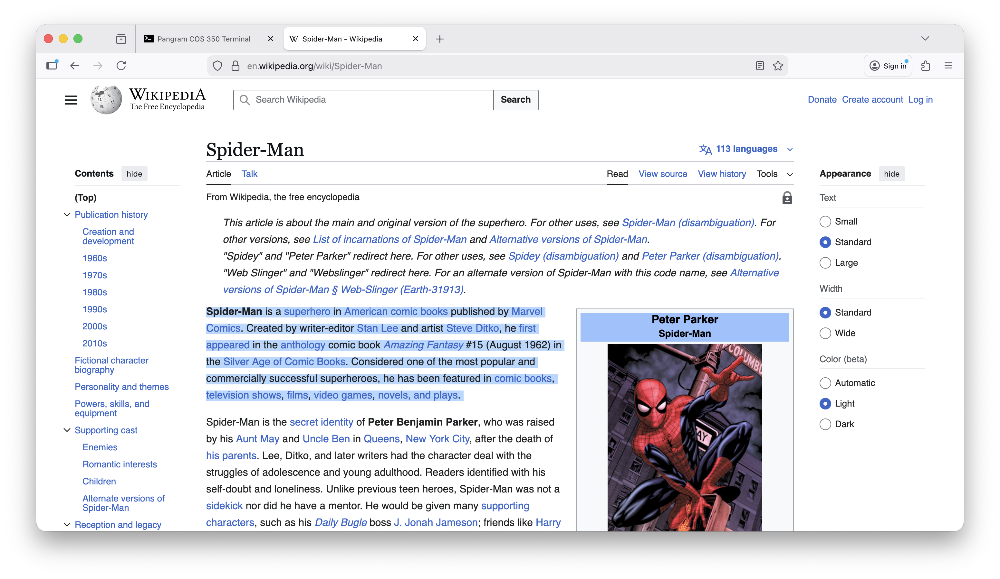
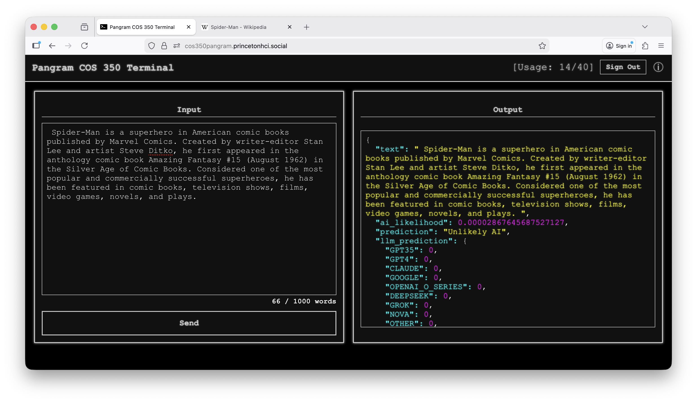
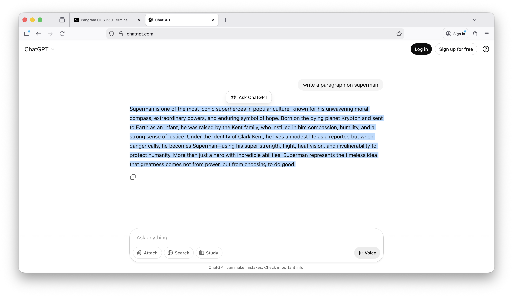
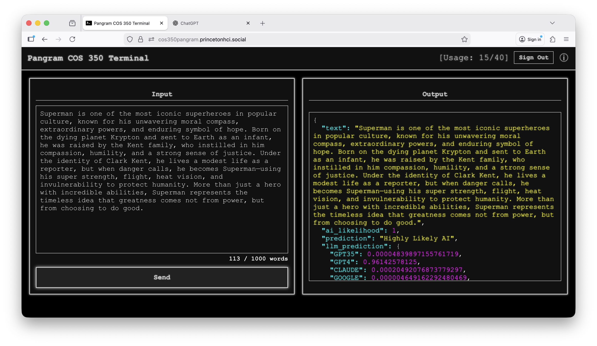

# Pangram COS 350 Terminal 🖥️🤖

A full-stack web tool for **COS 350 Assignment A4** that allows students to generate AI text, test it with the **Pangram AI detector**, and practice editing it to reduce AI-detection likelihood.

The project combines:

- **React frontend**: Handles MSAL login, text submission, UI, usage tracking, and threshold-based email alerts.
- **Firebase Functions backend**: Sends **email alerts** via Nodemailer.

---

## Example Analysis Screenshots

|                       **Spider-Man Wikipedia page**                       |              **Terminal analysis of Spider-Man text**               |
| :-----------------------------------------------------------------------: | :-----------------------------------------------------------------: |
|  |  |

|                    **ChatGPT Superman output**                     |          **Terminal analysis of Superman text**          |
| :----------------------------------------------------------------: | :------------------------------------------------------: |
|  |  |

_Caption: Top row shows Spider-Man content and its AI detection; bottom row shows ChatGPT Superman content and its AI detection._

---

## **Table of Contents**

- [Overview](#overview)
- [Features](#features)
- [Architecture](#architecture)
- [Prerequisites](#prerequisites)
- [Environment Variables](#environment-variables)
- [Local Development](#local-development)
- [Deployment](#deployment)
- [Project Structure](#project-structure)
- [Usage](#usage)
- [API Reference](#api-reference)
- [Notes](#notes)

---

## **Overview**

The Pangram COS 350 Terminal allows students to:

- Submit text and receive a **Pangram AI detection score** (via the frontend directly calling the Pangram API).
- Track **per-user usage** in Firestore.
- Authenticate via **Microsoft/Entra ID (MSAL)** with a whitelist of allowed users.
- Trigger **email alerts** when cumulative usage exceeds thresholds.

The backend only **sends email alerts** via SMTP.

---

## **Features**

- **MSAL Login/Logout**: Microsoft authentication with whitelist enforcement.
- **Pangram AI Submission**: Frontend calls Pangram API using a shared API key.
- **Usage Tracking**: Firestore tracks per-user usage; frontend enforces max usage.
- **Email Alerts**: Backend sends notifications when total usage passes thresholds.
- **Input/Output Panels**: Color-coded JSON output for easy inspection.
- **Help Modal**: Instructions and information about Pangram.

---

## **Architecture**

```
Frontend (React)
│
├─ public/
├─ src/
│   ├─ App.js               # Main component
│   ├─ JSONColorOutput.js   # Renders AI detection results
│   ├─ utils/firebase.js    # Firestore setup
│   └─ index.js             # App entry point with MsalProvider
├─ .env                     # Frontend environment variables
└─ package.json

Backend (Firebase Functions / Express)
│
├─ index.js                 # Handles /api/send-alert
├─ .env                     # Email credentials
├─ package.json
└─ node_modules/
```

- **Frontend** handles login, API calls, usage tracking, and alert logic.
- **Backend** only provides `/api/send-alert` endpoint.

---

## **Prerequisites**

- Node.js >= 18
- npm >= 9
- Firebase CLI (`npm install -g firebase-tools`)
- **Firebase project** with:

  - **Functions** (for `/api/send-alert`)
  - **Firestore** (for per-user usage tracking)
  - **Hosting** (for frontend deployment)

- Pangram API key
- Microsoft/Entra ID app for MSAL login
- SMTP credentials (for backend email alerts)

---

## **Environment Variables**

### Frontend (`frontend/.env`)

```env
# Backend API
REACT_APP_API_BASE_URL=http://localhost:5001/<project-id>/us-central1/app

# Pangram API key
REACT_APP_PANGRAM_API_KEY=your-pangram-api-key

# Input limits
REACT_APP_MAX_WORDS=1001
REACT_APP_MAX_USAGE=40

# MSAL login whitelist
REACT_APP_LOGIN_IDS="az1234,xy6741,rk1738"

# Email alert recipients and thresholds
REACT_APP_ALERT_EMAILS="az1234@princeton.edu,xy6741@princeton.edu,rk1738@cs.princeton.edu"
REACT_APP_ALERT_THRESHOLD=1000
REACT_APP_ALERT_STEP=100

# Firebase Firestore
REACT_APP_FIREBASE_API_KEY=your_firebase_api_key
REACT_APP_FIREBASE_AUTH_DOMAIN=your_project_id.firebaseapp.com
REACT_APP_FIREBASE_PROJECT_ID=your_project_id
REACT_APP_FIREBASE_STORAGE_BUCKET=your_project_id.appspot.com
REACT_APP_FIREBASE_MESSAGING_SENDER_ID=your_messaging_sender_id
REACT_APP_FIREBASE_APP_ID=your_app_id
REACT_APP_FIREBASE_MEASUREMENT_ID=your_measurement_id
REACT_APP_FIREBASE_FIRESTORE_COLLECTION=usage

# MSAL Configuration
REACT_APP_AZURE_CLIENT_ID=your_azure_app_client_id
REACT_APP_AZURE_TENANT_ID=your_tenant_id_or_common
REACT_APP_AZURE_REDIRECT_URI=http://localhost:3000/
```

### Backend (`functions/.env`)

```env
EMAIL_SERVICE=gmail
EMAIL_USER=your-email@gmail.com
EMAIL_PASS=your-app-password
```

---

## **Local Development**

### Backend

```bash
cd functions
npm install
firebase emulators:start --only functions
```

- Backend runs at `http://localhost:5001/<project-id>/us-central1/app`

### Frontend

```bash
cd frontend
npm install
npm start
```

- Frontend runs at `http://localhost:3000`
- Ensure `REACT_APP_API_BASE_URL` points to your local backend.

---

## **Deployment**

### Backend

```bash
cd functions
npm install
firebase deploy --only functions
```

- Live endpoint: `https://us-central1-<project-id>.cloudfunctions.net/app`

### Frontend

```bash
cd frontend
npm run build
firebase deploy --only hosting
```

---

## **Usage**

1. **Sign in** via Microsoft login. Only whitelisted users can access.
2. **Input text** (max words enforced).
3. **Submit** to Pangram API via frontend.
4. **View output** in color-coded JSON panel.
5. **Track usage** automatically in Firestore.
6. **Email alerts** sent when thresholds exceeded via backend `/api/send-alert`.
7. **Help modal** provides instructions and background info.

---

## **API Reference**

| Endpoint          | Method | Description                        |
| ----------------- | ------ | ---------------------------------- |
| `/api/send-alert` | POST   | Sends email alert using Nodemailer |

**Request body (JSON)**

```json
{
  "to": ["recipient1@example.com", "recipient2@example.com"],
  "subject": "Alert Subject",
  "message": "Alert message body"
}
```

**Response**

```json
{
  "success": true,
  "message": "Alert sent to recipient1@example.com, recipient2@example.com"
}
```

---

## **Project Structure**

```
root/
│
├─ frontend/
│   ├─ public/
│   ├─ src/
│   ├─ .env
│   └─ package.json
│
├─ functions/
│   ├─ index.js
│   ├─ .env
│   └─ package.json
```

---

## **Notes**

- Backend **only handles email alerts**; frontend handles login, Pangram API calls, and usage tracking.
- MSAL login ensures only allowed users can use the app.
- Firestore enforces usage limits server-side.
- Keep all `.env` files secret. Never commit API keys, passwords, or email credentials.
